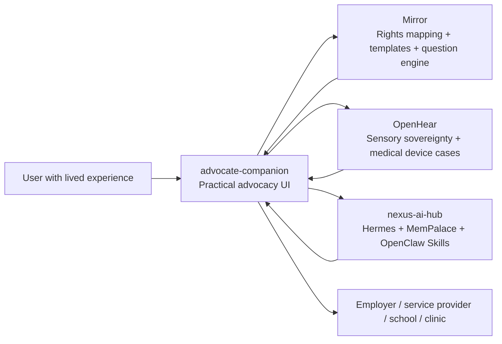
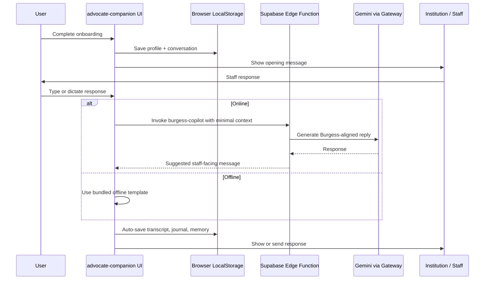
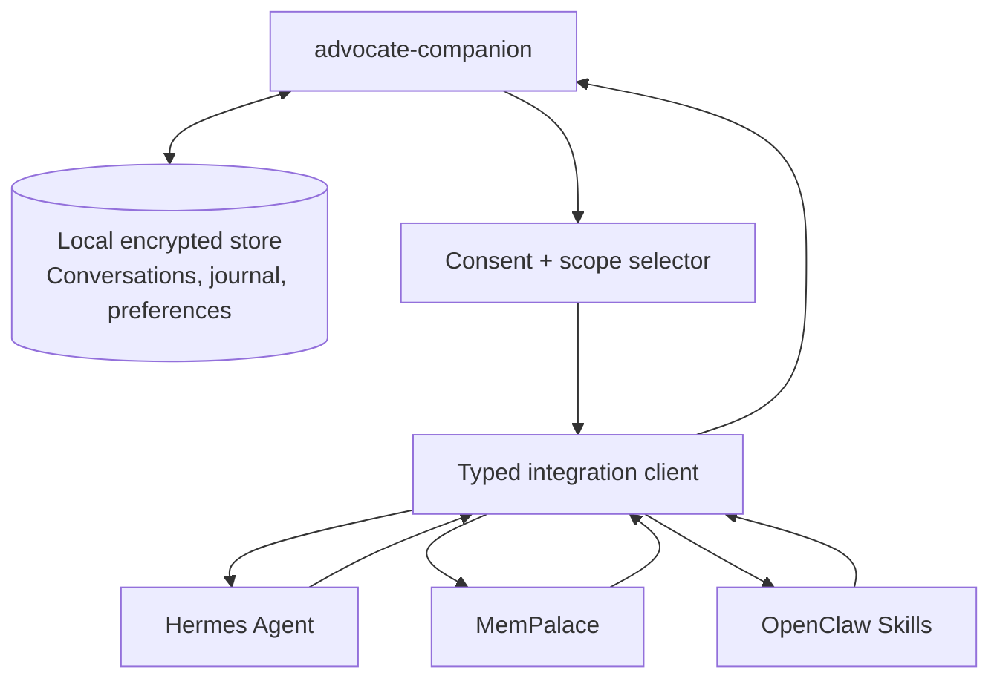
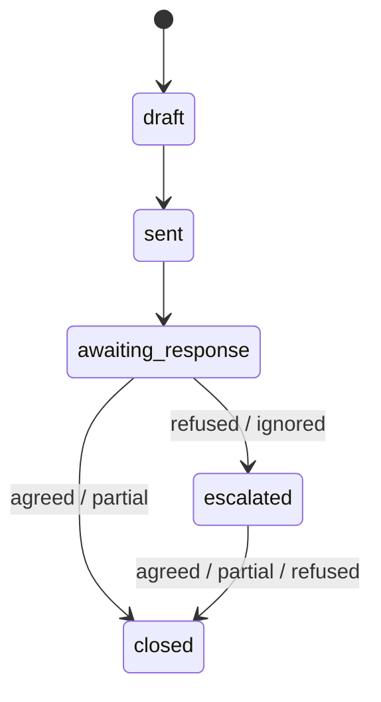

# Ecosystem Stack v2 — advocate-companion

## 1. Identity & Role in the Ecosystem

**advocate-companion** is the practical advocacy UI layer of the Burgess Principle ecosystem: a privacy-first React/TypeScript web application that helps people with hidden disabilities, sensory access needs, chronic conditions, neurodivergence, and other individual circumstances request reasonable adjustments or accommodations in clear, calm, evidence-aware language. This document uses `advocate-companion` for the repository/product module and **Advocate Companion** when describing the user-facing experience.

Its role is deliberately user-facing. Where the wider ecosystem contains institutional reasoning engines, sensory-sovereignty research, and central agent infrastructure, advocate-companion is the screen a person can actually use during a stressful interaction: at a reception desk, in an HR conversation, in a healthcare appointment, while replying to an email, or when documenting a refusal.

Within the three-pillar Burgess Principle ecosystem, advocate-companion sits at the human edge:

- **Mirror — Institutional Accountability:** advocate-companion turns Mirror's rights mapping, Burgess Principle question engine, and letter-template logic into guided conversations, journal records, draft emails, escalation messages, and evidence packs that ordinary users can understand and send.
- **OpenHear — Sensory Sovereignty:** advocate-companion gives OpenHear use cases a practical advocacy pathway: requesting hearing-aid adjustments, communication support, quiet clinical pathways, haptic or multisensory accommodations, patient-led device changes, and recognition of sensory substitution needs.
- **nexus-ai-hub — Central Intelligence Layer:** advocate-companion should remain the accessible front door for Hermes Agent, MemPalace, OpenClaw Skills, and shared Burgess Principle services, while keeping sensitive state local unless the user explicitly opts into cloud or agent-backed workflows.

The product is therefore not just another reasonable-adjustment form generator. It is the **frontline interface for individual consideration**: a local-first companion that helps a user move from lived experience to structured request, from institutional refusal to documented response, and from isolated casework to ecosystem-wide learning without surrendering privacy.



## 2. Core Technical Architecture (current state)

### Current stack

| Layer | Current implementation |
| --- | --- |
| Frontend runtime | React 18, TypeScript, Vite |
| UI system | Tailwind CSS, shadcn/ui, Radix UI primitives, lucide-react icons |
| Routing | React Router routes for main companion, about, landing, privacy, journal, and not-found views |
| Local state | React state plus custom hooks for conversations, journal entries, AI memory, accessibility, online status, speech-to-text, and text-to-speech |
| Persistence | Browser `localStorage` for conversations, journal entries, and AI memory |
| AI bridge | Supabase Edge Function `burgess-copilot` calling Gemini through the Lovable AI Gateway |
| Email bridge | Supabase Edge Functions for Graph-based mail ingest, draft generation, tone adjustment, and send-mail workflow |
| Offline support | Static offline templates for common workplace, education, healthcare, and escalation requests |
| Exports | PDF generation for conversation logs and AI memory |
| Quality tooling | ESLint, Vitest, Playwright accessibility tests, Vite production build |

### Privacy architecture

The current implementation is **LocalStorage-first**. The browser is the primary data store, and the cloud is used only for narrowly scoped AI or email workflows. Because disability, health, employment, and sensory-access data is sensitive, this is a pragmatic current-state baseline rather than the final security posture: Ecosystem Stack v2 should move short-term storage to encrypted IndexedDB/passcode-protected case files while preserving local-first ownership.

Local data includes:

- User profile context: `fullName`, `adjustment`, `country`, and free-text situation context.
- Conversation records under `burgess-conversations`.
- Journal entries under `burgess_journal`.
- AI memory summaries under `burgess-ai-memory`.
- Offline templates bundled with the app.

Cloud-touching paths are intentionally limited:

1. The UI invokes `supabase.functions.invoke("burgess-copilot")` with the current profile, conversation log, system context, optional memory context, and user message.
2. The Supabase Edge Function constructs a Burgess Principle prompt and calls Gemini through the Lovable AI Gateway.
3. For email workflows, Supabase functions can ingest Microsoft Graph messages, generate a draft response, store pending drafts, adjust tone, and send approved mail.

This creates a useful but explicit trade-off: local-first storage protects sensitive disability and advocacy context, while remote AI improves response quality. Ecosystem Stack v2 should preserve this model by treating cloud intelligence as an **optional processor**, not the source of truth.

### Current component structure and data flow

The current UI is organized around a small set of high-leverage components and hooks:

```text
src/
├── pages/
│   ├── Index.tsx              # Main companion route and conversation selection
│   ├── About.tsx              # Burgess Principle explainer
│   ├── Landing.tsx
│   ├── Privacy.tsx
│   └── NotFound.tsx
├── components/
│   ├── OnboardingScreen.tsx   # Profile and adjustment capture
│   ├── ConversationView.tsx   # Core conversation, AI, journal, memory, offline, TTS/STT flow
│   ├── ConversationHistory.tsx
│   ├── StaffDisplay.tsx       # Large-screen message mode for showing staff
│   ├── JournalView.tsx
│   ├── JournalThread.tsx
│   ├── EmailDraftReview.tsx
│   ├── AccessibilityPanel.tsx
│   └── ui/                    # shadcn/ui primitives
├── hooks/
│   ├── useConversationStorage.ts
│   ├── useJournal.ts
│   ├── useAIMemory.ts
│   ├── useOnlineStatus.ts
│   ├── useSpeechToText.ts
│   ├── useTextToSpeech.ts
│   └── useAccessibility.ts
├── types/
│   ├── burgess.ts
│   └── journal.ts
├── lib/
│   ├── offlineTemplates.ts
│   ├── generateLogPDF.ts
│   └── generateMemoryPDF.ts
└── integrations/supabase/
```

Current application flow:

1. `Index.tsx` loads saved conversations through `useConversationStorage`.
2. If no active conversation exists, `OnboardingScreen` collects a minimal `UserProfile`.
3. `ConversationView` generates an opening message and stores conversation updates locally.
4. Staff replies can be typed or dictated with speech-to-text.
5. Online mode sends context to `burgess-copilot`; offline mode presents curated templates.
6. AI responses appear as phone-ready messages for direct staff display.
7. Users can copy, email, export PDF, save to journal, summarize into local AI memory, or start over.
8. Journal entries preserve requests, responses, follow-ups, and status so the user has a record if escalation becomes necessary.



## 3. Ecosystem Integration Architecture v2 (new technical focus)

Ecosystem Stack v2 should evolve advocate-companion from a standalone companion into a **local-first client for shared Burgess Principle services**. The key architectural rule is that integrations should be capability-based and consent-gated: each external service receives only the specific context required for the task.

### Integration with nexus-ai-hub

**Proposed role:** nexus-ai-hub becomes the optional intelligence and orchestration backend, while advocate-companion remains the user-owned interface and local state authority.

Recommended integration points:

- **Hermes Agent as backend brain:** route complex multi-step advocacy tasks to Hermes, such as preparing an escalation pathway, comparing legal options across jurisdictions, extracting obligations from a refusal email, or coordinating Mirror and OpenHear services.
- **MemPalace for durable memory:** sync selected user-approved summaries, adjustment history, successful arguments, preferred tone, and recurring institutional patterns into MemPalace. The current `burgess-ai-memory` LocalStorage object is a strong prototype for this model.
- **OpenClaw Skills as task modules:** expose specialist skills, such as contract review, complaint drafting, rights mapping, sensory-access planning, clinical communication support, and evidence-pack assembly.
- **Advocate Companion API boundary:** introduce a typed client layer such as `src/services/nexusClient.ts` rather than calling agent endpoints directly from components.

Recommended integration pattern:



Implementation recommendations:

- Add a `SyncScope` model with values such as `none`, `singleRequest`, `journalSummary`, `memorySummary`, and `fullCaseFile`.
- Keep raw transcripts local by default; sync summaries unless the user explicitly exports a full evidence pack.
- Support end-to-end encrypted payloads for MemPalace where practical.
- Use background sync queues for offline-first operation.
- Return structured outputs, not just text, so the UI can render next steps, citations, risk flags, and requested adjustments separately.

### Integration with Mirror

**Proposed role:** Mirror supplies institutional accountability intelligence: rights templates, jurisdiction-specific mapping, Burgess Principle questions, and letter generation.

Recommended integration points:

- **Rights template service:** fetch templates by country, setting, disability/condition, institution type, and requested adjustment.
- **Burgess question service:** generate the key institutional-accountability questions the user should ask, such as whether an individual assessment occurred, who made the decision, what evidence was considered, and how proportionality was evaluated.
- **Automated letter generation:** convert conversation and journal records into formal request letters, refusal follow-ups, complaint letters, tribunal-ready summaries, or medical-access letters.
- **Decision audit trail:** attach Mirror metadata to each request so the user can later show what decision was made, by whom, under what policy, and whether individual consideration occurred.

Recommended Mirror-facing data contract:

```ts
type StandardInstitutionType = "employer" | "education" | "healthcare" | "retail" | "government" | "transport" | "housing";

type MirrorInstitution =
  | { institutionType: StandardInstitutionType; otherInstitutionType?: never }
  | { institutionType: "other"; otherInstitutionType: string };

type MirrorRightsRequest = MirrorInstitution & {
  jurisdiction: string;
  adjustmentCategory: string[];
  userContextSummary: string;
  decisionStage: "initial_request" | "follow_up" | "refusal" | "ignored" | "appeal";
  burgessMetadata: BurgessPrincipleMetadata;
};
```

Mirror should return structured content:

- Applicable rights and duties.
- Plain-English explanation.
- Suggested questions.
- Template fragments.
- Escalation routes.
- Confidence and jurisdiction caveats.

### Integration with OpenHear

**Proposed role:** OpenHear supplies sensory-sovereignty and medical-device context, while advocate-companion turns that context into requests, records, and communication artifacts.

OpenHear-related advocacy should include:

- Hearing-aid fitting and adjustment requests.
- Requests for quiet rooms, written communication, captioning, BSL/interpreter support, loop systems, reduced sensory load, or longer appointments.
- Haptic wristband profile accommodations and multisensory substitution preferences.
- Universal Friend context: user-controlled assistance that translates sensory needs into institution-readable language without pathologizing the user.
- Patient-led innovation and biohacking movement use cases, where a user needs institutions to recognize self-tested assistive workflows, device settings, or sensory profiles as legitimate access needs.

Recommended OpenHear integration points:

- **Sensory profile import:** import user-approved sensory preferences, haptic profiles, auditory sensitivities, device constraints, and communication modes.
- **Medical-device request builder:** generate adjustment letters for audiology, ENT, occupational health, education, employers, and service providers.
- **Universal Friend handoff:** allow a Universal Friend session to pass a concise sensory context card into advocate-companion for advocacy use.
- **Evidence timeline:** record device settings, sensory incidents, access barriers, and successful substitutions as structured journal evidence.

Recommended OpenHear-facing data contract:

```ts
interface SensoryAccessProfile {
  profileId: string;
  communicationModes: Array<"speech" | "text" | "captioning" | "sign" | "haptic" | "visual" | "other">;
  customCommunicationModes?: Array<{
    mode: string;
    description: string;
    experimental: boolean;
  }>;
  auditoryNeeds?: string[];
  hapticProfiles?: Array<{
    id: string;
    label: string;
    purpose: "alerting" | "navigation" | "speech_substitution" | "environmental_awareness" | "other";
    customPurpose?: string;
    userControlled: boolean;
  }>;
  sensoryTriggers?: string[];
  preferredAdjustments: string[];
  medicalDeviceContext?: {
    deviceType: string;
    clinicianOrProvider?: string;
    accessRequestCategory?: "communication" | "environment" | "appointment_format" | "device_review" | "documentation" | "other";
    requestedChange?: string;
  };
}
```

OpenHear schema validation should treat `customPurpose` as required when haptic `purpose` is `"other"`. Experimental communication modes should trigger clearer consent copy and institution-facing explanation text. Medical-device free text, especially `requestedChange`, must be sanitized and framed as a user-described access need rather than diagnosis, treatment, clinical parameter adjustment, or medical configuration instruction.

### Shared state and data models

The current `UserProfile`, `SavedConversation`, `Message`, `JournalEntry`, and `AIMemory` models are effective prototypes, but Ecosystem Stack v2 needs shared schemas that can represent Mirror, OpenHear, and nexus-ai-hub workflows without duplicating user context.

Recommended canonical models:

```ts
interface UnifiedUserContext {
  userId?: string;
  displayName?: string;
  jurisdiction: string;
  accessibilityNeeds: string[];
  communicationPreferences: string[];
  sensoryProfileId?: string;
  privacyMode:
    | "local_only"      // no network or ecosystem processing; local templates and local storage only
    | "local_plus_ai"   // minimal prompt may go through Supabase Edge Functions to approved AI providers; source records stay local
    | "selective_sync"; // user-approved summaries or fields sync to ecosystem services
  exportPolicy: "disabled" | "manual_case_file"; // explicit export capability, independent of sync mode
  consentScopes: SyncScope[];
}

interface AdjustmentRequest {
  id: string;
  createdAt: string;
  updatedAt: string;
  stage: "draft" | "sent" | "awaiting_response" | "escalated" | "closed";
  outcome?: "agreed" | "partial" | "refused" | "ignored";
  setting: "work" | "education" | "healthcare" | "public_service" | "commercial_service" | "transport" | "housing" | "other";
  requestedAdjustments: string[];
  reasonSummary: string;
  institution?: {
    name?: string;
    contact?: string;
    role?: string;
  };
  mirror?: MirrorDecisionContext;
  openHear?: SensoryAccessProfile;
  burgess: BurgessPrincipleMetadata;
}

interface BurgessPrincipleMetadata {
  classification: "SOVEREIGN" | "NULL" | "AMBIGUOUS"; // three-outcome ecosystem test result
  sovereignQuestionAsked: boolean;
  individualConsiderationEvidence?: string;
  blanketPolicyDetected: boolean;
  decisionMakerIdentified?: boolean;
  reasonsRequested?: boolean;
  blanketPolicyLikelihood: "low" | "medium" | "high"; // likelihood that the institution is applying a Burgess NULL blanket policy
  auditNotes?: string[];
}
```

Recommended request lifecycle:



Recommended client architecture:

- `src/domain/` for shared TypeScript models and schema validation.
- `src/storage/` for local persistence adapters and future encrypted IndexedDB support.
- `src/services/` for Supabase, Mirror, OpenHear, and nexus clients.
- `src/features/conversation/`, `src/features/journal/`, `src/features/email/`, `src/features/evidence/`, and `src/features/sensory/` for feature-oriented components.
- A `CaseFile` aggregate that can export a complete user-owned bundle without requiring cloud sync.

## 4. Burgess Principle Implementation Layer

The current UI already implements the practical shape of the Burgess Principle by turning the SOVEREIGN/NULL test into plain-language interaction design.

Current enforcement patterns:

- **Individual context first:** onboarding asks for the person's name, adjustment need, country, and situation context before generating a message.
- **Blanket-policy challenge:** opening messages explicitly ask staff to consider the user's individual circumstances rather than applying a generic rule.
- **Staff-facing language:** responses are written in first person so the user can show them directly on a phone without translating legal concepts under pressure.
- **Legal grounding without legal intimidation:** the AI references the Equality Act 2010, ADA, or other jurisdictional duties when appropriate, but the prompt discourages jargon.
- **Conversation logging:** transcripts, journal entries, follow-ups, and PDF exports preserve the history of whether individual consideration occurred.
- **Memory loop:** local AI memory summarizes what worked, preferred tone, staff response patterns, and lessons learned.
- **Offline continuity:** bundled templates keep the user supported even when AI or internet access is unavailable.

In this framing, aligned with the wider ecosystem (burgess-principle v2.6.6, Mirror), every institutional response is classified into one of three outcomes:

- **SOVEREIGN** means a named decision-maker considers the user's specific circumstances, access needs, evidence, and proposed adjustment.
- **NULL** means a decision is produced by blanket policy, automation, convenience, refusal scripts, or institutional habit without meaningful individual consideration.
- **AMBIGUOUS** means the institution replies with vague process language ("human oversight", "reviewed in line with policy") without confirming that a named reviewer considered the user's specific facts. AMBIGUOUS is treated as NULL until clarified.

NULL and AMBIGUOUS are the documented starting point for escalation and repair, not a final verdict.

Proposed improvements:

1. **Make Burgess metadata explicit.** Every generated request should carry structured metadata: whether a blanket policy is involved, whether reasons were requested, whether a decision-maker was identified, and what evidence of individual consideration exists.
2. **Add a SOVEREIGN/NULL review step.** Before export or escalation, show a calm checklist that helps the user determine whether the institution actually considered their case.
3. **Wrap all AI outputs.** Require AI responses to return both user-facing text and internal Burgess analysis fields so the UI can explain why a response is recommended.
4. **Unify conversation and journal state.** Treat each conversation as part of an `AdjustmentRequest`, not as an isolated chat transcript.
5. **Add institutional decision capture.** Prompt the user to record who made the decision, what reason was given, what policy was cited, and whether alternatives were considered.
6. **Support sensory-sovereignty cases.** Extend the principle beyond employment-style adjustments into clinical access, hearing-aid settings, haptic profiles, Universal Friend support, and patient-led assistive workflows.
7. **Create escalation-ready evidence packs.** Generate structured summaries showing the original request, responses, Burgess NULL indicators, applicable rights, and requested remedy.
8. **Add safety guardrails for medical-device contexts.** Keep prompts and UI labels focused on access barriers, communication preferences, device-setting history, and user-requested adjustments; block diagnosis/treatment phrasing, show clinical-safety disclaimers, and route clinical decisions back to qualified professionals.

## 5. Feature Evolution Roadmap

### Short term (1–3 months): integration readiness and shared models

- Introduce canonical domain models for `UnifiedUserContext`, `AdjustmentRequest`, `BurgessPrincipleMetadata`, `MirrorDecisionContext`, and `SensoryAccessProfile`.
- Refactor LocalStorage access behind persistence adapters so encrypted IndexedDB or optional sync can be added without changing UI components.
- Add consent-scoped integration settings for local-only, AI-assisted, selective sync, and export modes.
- Convert current conversation, journal, and AI memory records into a single case/request model.
- Add structured AI response parsing so Gemini/Hermes outputs can include message text, reasoning metadata, next steps, and risk flags.
- Build a typed nexus client boundary for future Hermes, MemPalace, and OpenClaw Skill calls.
- Add Mirror-ready template categories for workplace, education, healthcare, public services, transport, retail, and government contexts.
- Add OpenHear-ready sensory request categories: hearing aid adjustment, captioning, quiet pathway, haptic support, written communication, sensory-load reduction, and interpreter support.

### Medium term (6–18 months): native Mirror + OpenHear support and offline-first AI

- Integrate Mirror rights-template retrieval and Burgess question generation.
- Add formal letter and evidence-pack generation using Mirror templates and local case data.
- Add OpenHear sensory profile import/export with explicit user approval.
- Support Universal Friend handoff cards for sensory context and communication preferences.
- Add medical-device advocacy flows for audiology, hearing aids, haptic wristbands, multisensory substitution, and patient-led device adaptations.
- Move from LocalStorage to encrypted IndexedDB for larger case files, attachments, and evidence timelines.
- Add background sync queues for opt-in MemPalace updates and delayed AI processing.
- Explore local or edge AI modes for offline drafting, template selection, summarization, and Burgess NULL triage.
- Add role-specific outputs: user script, email draft, formal letter, clinician note, HR request, complaints summary, and tribunal/ombudsman timeline.

### Long term: primary user interface for the full ecosystem

- Position advocate-companion as the primary user interface for Mirror, OpenHear, Universal Friend, Hermes, MemPalace, and OpenClaw Skills.
- Let users manage a lifetime portfolio of adjustment requests, sensory profiles, patient-led innovations, successful strategies, institutional responses, and evidence packs.
- Support cross-device continuity through encrypted, consent-based sync while keeping local-first as the default.
- Provide an ecosystem command center: ask for help, review rights, prepare letters, log outcomes, manage sensory access, export evidence, and coordinate agent-backed workflows.
- Establish advocate-companion as the practical bridge between disability rights, sensory sovereignty, medical-device self-advocacy, and the wider biohacking/patient-led innovation movement.

## 6. Technical Differentiators & Trade-offs

### Differentiators

Compared with typical advocacy tools, reasonable-adjustment templates, HR letter generators, or legal-information sites, advocate-companion is differentiated by:

- **Real-time conversational use:** it supports live staff interactions, not only after-the-fact letter writing.
- **Phone-first staff display:** messages are generated to be shown directly to another person in a stressful moment.
- **Local-first memory:** conversation history, journal records, and learned preferences stay on the user's device by default.
- **Burgess Principle audit layer:** the product is organized around whether individual consideration occurred, not merely whether a template was completed.
- **Cross-domain architecture:** the same UI can support employment, education, healthcare, public services, sensory access, medical-device settings, and institutional complaints.
- **Offline fallback:** curated templates remain available without AI or network access.
- **Ecosystem compatibility:** the roadmap connects user-facing advocacy with Mirror rights intelligence, OpenHear sensory-sovereignty data, and nexus-ai-hub agent orchestration.
- **Patient-led innovation support:** it can describe user-developed assistive strategies, biohacking-derived workflows, haptic profiles, and sensory substitution methods in institution-readable language.

### Trade-offs

| Trade-off | Risk | Ecosystem Stack v2 response |
| --- | --- | --- |
| LocalStorage simplicity vs sensitive data protection | LocalStorage is easy to inspect on a shared device and does not scale well for evidence files | Move toward encrypted IndexedDB, passcode-protected case files, and clear local-delete controls |
| Remote AI quality vs privacy | AI prompts may include sensitive disability, health, employment, or institutional context | Use minimal prompts, consent scopes, local summaries, optional redaction, and future local/edge models |
| Rich memory vs user control | Persistent memory can feel intrusive if users do not understand what is saved | Keep memory visible, editable, exportable, clearable, and opt-in for cloud sync |
| Ecosystem integration vs complexity | Mirror, OpenHear, and nexus-ai-hub integrations could make the UI overwhelming | Hide complexity behind task-specific flows and progressive disclosure |
| Legal precision vs readability | Overly legalistic responses may intimidate users or staff | Use Mirror for structured rights accuracy while keeping user-facing language plain and calm |
| Medical-device specificity vs safety | Device and sensory recommendations can cross into clinical advice | Enforce prompt and UI guardrails: describe user needs, device context, access barriers, and requested accommodations; avoid diagnosis, treatment plans, clinical parameter adjustments, medical configuration changes, or clinician substitution |
| Biohacking and patient-led innovation vs institutional trust | Institutions may dismiss self-tested workflows or non-traditional assistive devices | Translate user-led experimentation into evidence, access need, risk reduction, and reasonable adjustment language |

The ecosystem resolves these tensions by separating responsibilities:

- advocate-companion owns the accessible UI, local case file, user consent, and practical outputs.
- Mirror owns rights mapping, template integrity, and institutional accountability logic.
- OpenHear owns sensory-sovereignty context, device-adjacent profiles, and multisensory substitution knowledge.
- nexus-ai-hub owns optional orchestration, long-term memory, agent skills, and cross-service intelligence.

## 7. North Star Vision

The North Star for advocate-companion is to become the **primary user interface for the full Burgess Principle ecosystem**: the place where a person can safely turn lived experience into a clear request, a documented case, an institutional challenge, or a sensory-access plan.

In that future, a user should be able to open advocate-companion and say:

- "I need my employer to adjust this process."
- "My clinic will not accommodate my sensory needs."
- "My hearing-aid settings and haptic alerts are part of how I access the world."
- "A service provider applied a blanket policy and ignored my individual circumstances."
- "Help me explain my patient-led assistive setup in a way an institution will understand."

The application should then assemble the right combination of local context, Mirror rights intelligence, OpenHear sensory profile, Universal Friend communication support, Hermes reasoning, MemPalace history, and OpenClaw specialist skills — while keeping the user in control of what is stored, what is shared, and what is sent.

The ultimate role of advocate-companion is therefore not to automate advocacy away from the person. It is to **restore agency at the point where institutions often remove it**: giving users calm language, structured evidence, sensory sovereignty, and Burgess Principle-compliant decision pressure without forcing them to become lawyers, clinicians, technologists, or policy experts.
